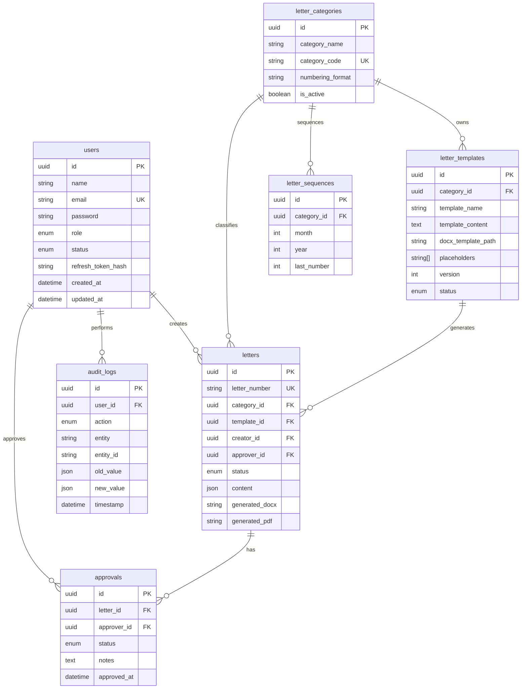

# ERD Design

```mermaid
erDiagram
  users ||--o{ letters : creates
  users ||--o{ approvals : approves
  users ||--o{ audit_logs : performs
  letter_categories ||--o{ letter_templates : owns
  letter_categories ||--o{ letters : classifies
  letter_categories ||--o{ letter_sequences : sequences
  letter_templates ||--o{ letters : generates
  letters ||--o{ approvals : has

  users {
    uuid id PK
    string name
    string email UK
    string password
    enum role
    enum status
    string refresh_token_hash
    datetime created_at
    datetime updated_at
  }

  letter_categories {
    uuid id PK
    string category_name
    string category_code UK
    string numbering_format
    boolean is_active
  }

  letter_templates {
    uuid id PK
    uuid category_id FK
    string template_name
    text template_content
    string docx_template_path
    string[] placeholders
    int version
    enum status
  }

  letter_sequences {
    uuid id PK
    uuid category_id FK
    int month
    int year
    int last_number
  }

  letters {
    uuid id PK
    string letter_number UK
    uuid category_id FK
    uuid template_id FK
    uuid creator_id FK
    uuid approver_id FK
    enum status
    json content
    string generated_docx
    string generated_pdf
  }

  approvals {
    uuid id PK
    uuid letter_id FK
    uuid approver_id FK
    enum status
    text notes
    datetime approved_at
  }

  audit_logs {
    uuid id PK
    uuid user_id FK
    enum action
    string entity
    string entity_id
    json old_value
    json new_value
    datetime timestamp
  }
```
